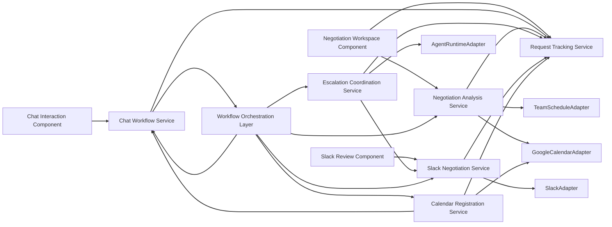

# コンポーネント依存関係

## 依存関係サマリー

### 依存方向の原則
- フロントエンド機能コンポーネントはアプリケーションサービスに依存する
- アプリケーションサービスは Adapter 抽象と永続化サービスに依存する
- Adapter は外部 API 実装詳細を隠蔽する
- Step Functions は Workflow Orchestration Layer を通じてサービス群を順序制御する

## 依存マトリクス

| コンポーネント | 依存先 | 依存理由 |
|---|---|---|
| Chat Interaction Component | Chat Workflow Service, Request Tracking Service | 会話進行と確認応答を扱うため |
| Negotiation Workspace Component | Negotiation Analysis Service, Request Tracking Service | 要約表示と状態表示のため |
| Slack Review Component | Slack Negotiation Service | Slack 投稿レビューのため |
| Chat Workflow Service | Request Tracking Service, Workflow Orchestration Layer | 会話進行と状態同期のため |
| Negotiation Analysis Service | TeamScheduleAdapter, GoogleCalendarAdapter, Request Tracking Service | 予定分析と内部判断のため |
| Escalation Coordination Service | AgentRuntimeAdapter, Slack Negotiation Service, Request Tracking Service | エスカレーション判断と参加制御のため |
| Slack Negotiation Service | SlackAdapter, Request Tracking Service | ドラフト生成、投稿、結果保存のため |
| Calendar Registration Service | GoogleCalendarAdapter, Chat Workflow Service, Request Tracking Service | 登録確認と登録実行のため |
| Workflow Orchestration Layer | 全アプリケーションサービス | 実行順序制御のため |

## 通信パターン

### 同期通信
- フロントエンド -> API 層 -> アプリケーションサービス
- アプリケーションサービス -> Adapter
- Workflow Orchestration Layer -> 各サービス

### 非同期 / 待機を含む通信
- Step Functions によるレビュー待ち
- 弁護士サブエージェント参加後の交渉継続
- Calendar 登録前のチャット確認待ち

## データフロー

### フロー 1: チャット開始から分析まで
1. 依頼者が Chat Interaction Component へ自然文を入力
2. Chat Workflow Service が Request Tracking Service へ初期状態を保存
3. Workflow Orchestration Layer が意図抽出と不足情報確認を実行
4. Negotiation Analysis Service がカレンダー・チーム情報を取得

### フロー 2: 分析から Slack 投稿まで
1. Negotiation Analysis Service が交渉方針を生成
2. Slack Negotiation Service がドラフトを生成
3. Slack Review Component がレビュー UI を表示
4. 承認後、SlackAdapter 経由でスレッド投稿

### フロー 3: エスカレーション
1. Escalation Coordination Service が交渉履歴を評価
2. AgentRuntimeAdapter が弁護士サブエージェントを起動
3. 同一スレッド文脈に参加させる
4. 更新方針を Slack Negotiation Service と Request Tracking Service に反映

### フロー 4: Calendar 登録
1. 交渉成立後、Calendar Registration Service が候補内容を作成
2. Chat Workflow Service がチャットで登録可否を確認
3. 承認後、GoogleCalendarAdapter が登録
4. Request Tracking Service が登録結果を保持

## Mermaid 図


## テキスト代替
```text
UI
- Chat Interaction Component -> Chat Workflow Service
- Negotiation Workspace Component -> Negotiation Analysis Service / Request Tracking Service
- Slack Review Component -> Slack Negotiation Service

Application Services
- Chat Workflow Service -> Request Tracking Service / Workflow Orchestration Layer
- Negotiation Analysis Service -> TeamScheduleAdapter / GoogleCalendarAdapter / Request Tracking Service
- Escalation Coordination Service -> AgentRuntimeAdapter / Slack Negotiation Service / Request Tracking Service
- Slack Negotiation Service -> SlackAdapter / Request Tracking Service
- Calendar Registration Service -> GoogleCalendarAdapter / Chat Workflow Service / Request Tracking Service

Orchestration
- Workflow Orchestration Layer -> 各アプリケーションサービス
```
