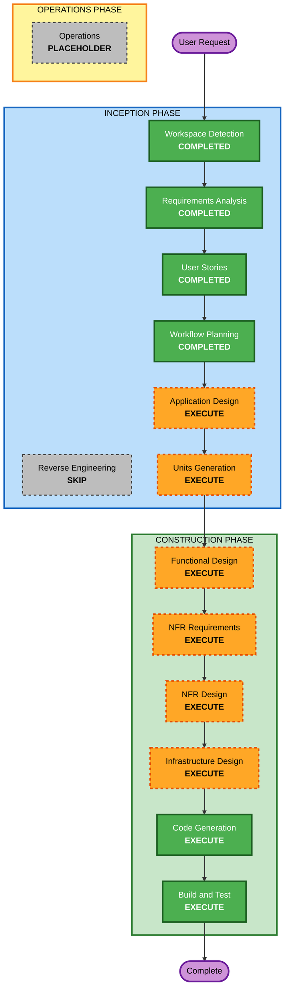

# 実行計画

## 詳細分析サマリー

### 変更スコープ
- **変更タイプ**: グリーンフィールドの新規システム設計および実装
- **主な変更内容**: チャット UI、Slack 交渉スレッド処理、必要時の弁護士エージェント参加、Google Calendar 登録、ワークフロー制御、永続化追跡を含む AI エージェント型の有休交渉 Web アプリを新規構築する
- **関連コンポーネント**:
  - フロントエンド Web アプリケーション
  - バックエンドのオーケストレーションおよびエージェント実行基盤
  - Slack Adapter
  - Google Calendar Adapter
  - 永続化レイヤー
  - 可観測性およびワークフロー監視

### 影響評価
- **ユーザー向け変更**: あり。2 つの交渉モードを持つ新しいチャットファースト UX が中核成果物である。
- **構造変更**: あり。マルチエージェント構成、外部 Adapter、状態を持つオーケストレーション、ワークフロー追跡が必要である。
- **データモデル変更**: あり。チャットセッション、休暇リクエスト、ユーザー情報、予定情報、生成成果物など複数の永続化対象が必要である。
- **API 変更**: あり。チャット進行、ワークフロー状態管理、Slack レビュー/投稿、Calendar 登録のための新規 API が必要である。
- **NFR 影響**: あり。デモ信頼性、可観測性、フォールバック、テスト戦略が明示要件になっている。

### リスク評価
- **リスクレベル**: 高
- **ロールバック複雑度**: 中
- **テスト複雑度**: 高
- **主なリスク要因**:
  - 複数の外部連携
  - モードごとに異なる振る舞い
  - 交渉スレッド内での弁護士エージェント参加
  - 交渉成立後の Calendar 登録
  - 部分障害下でも成立させる必要があるデモ信頼性

## ワークフロー可視化

### Mermaid 図


### テキスト代替
```text
INCEPTION
- Workspace Detection: COMPLETED
- Reverse Engineering: SKIP
- Requirements Analysis: COMPLETED
- User Stories: COMPLETED
- Workflow Planning: COMPLETED
- Application Design: EXECUTE
- Units Generation: EXECUTE

CONSTRUCTION
- Functional Design: EXECUTE
- NFR Requirements: EXECUTE
- NFR Design: EXECUTE
- Infrastructure Design: EXECUTE
- Code Generation: EXECUTE
- Build and Test: EXECUTE

OPERATIONS
- Operations: PLACEHOLDER
```

## 実行対象ステージ

### INCEPTION PHASE
- [x] Workspace Detection
- [x] Reverse Engineering - SKIP
  - **理由**: 本件はグリーンフィールドであり、既存アプリケーションコードの解析が不要なため。
- [x] Requirements Analysis
- [x] User Stories
- [x] Workflow Planning
- [ ] Application Design - EXECUTE
  - **理由**: 新規コンポーネント、サービス境界、エージェント責務、Adapter 契約を実装前に定義する必要があるため。
- [ ] Units Generation - EXECUTE
  - **理由**: フロントエンド、オーケストレーション、外部連携、永続化、可観測性にまたがる複数の作業単位へ分解が必要なため。

### CONSTRUCTION PHASE
- [ ] Functional Design - EXECUTE
  - **理由**: モード差分、交渉分岐、エスカレーション挙動、Calendar 登録フローの詳細設計が必要なため。
- [ ] NFR Requirements - EXECUTE
  - **理由**: デモ信頼性、可観測性、フォールバック、テスト戦略が明示されており、独立した整理が必要なため。
- [ ] NFR Design - EXECUTE
  - **理由**: 特定した NFR を実装前に設計へ組み込む必要があるため。
- [ ] Infrastructure Design - EXECUTE
  - **理由**: AWS ネイティブ構成、Step Functions、Secrets、ログ、デプロイ対応を明示的にマッピングする必要があるため。
- [ ] Code Generation - EXECUTE
  - **理由**: 実装計画とコード生成は必須のため。
- [ ] Build and Test - EXECUTE
  - **理由**: ビルド検証、統合テスト、デモ準備確認が必須のため。

### OPERATIONS PHASE
- [ ] Operations - PLACEHOLDER
  - **理由**: 現行の AI-DLC では将来拡張扱いのため。

## 想定スケジュール
- **Construction 完了までの残ステージ数**: 8
- **想定工数**: 中から大。アーキテクチャ、マルチエージェント挙動、外部連携、信頼性設計を含むため。

## 成功条件
- **主目的**: 有休交渉 MVP の残り AI-DLC ステージを適切な順序で進められる、明確でレビュー可能な実行計画を作成すること
- **主要成果物**:
  - コンポーネントおよびサービス設計
  - 作業単位分解
  - 単位ごとの機能設計および NFR 設計
  - インフラマッピング
  - 生成コードおよびテスト
  - ビルド/テスト手順
- **品質ゲート**:
  - モードごとの差分が曖昧にならないこと
  - 弁護士エージェントのエスカレーション挙動が明示設計されること
  - Google Calendar 登録が交渉成立後にのみ行われること
  - デモ用フォールバックと可観測性が設計から実装まで維持されること
